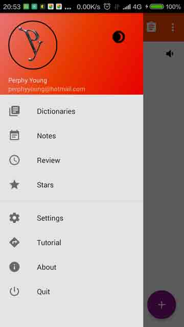
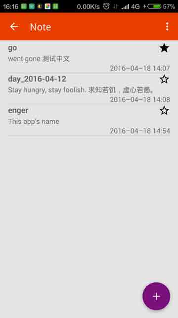
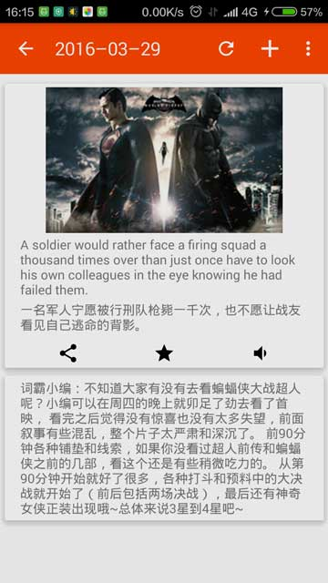
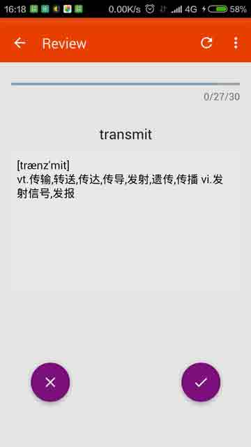

# Enger
Simple app with both standard (StarDict) and custom dictionary feature.  
For more detail, please check out [wiki](https://github.com/perphyyoung/Enger/wiki)

# Screenshots

# Features Worth Mentioning
* Custom dictionary (treat as note)
* Import & export note (as json file)

# Notice
### How to install dictionary
Put your decompressed files (contain *.dict, *.idx, *.ifo) into the **Enger/dic** directory, which is in the root of your phone's *internal* memory. (On your installing this app, it will be create automatically.) You can take Enger.zip as an example.

### How to import and export note
Note activity has a overflow button, tap it you will see some action you can do.

# Third Part Libraries
* [guava](https://github.com/google/guava)
* [picasso](https://github.com/square/picasso)
* [CircleImageView](https://github.com/hdodenhof/CircleImageView)
* [RecyclerView-FlexibleDivider](https://github.com/yqritc/RecyclerView-FlexibleDivider)
* [SwipeMenuRecyclerView](https://github.com/TUBB/SwipeMenuRecyclerView)
* [MaterialEditText](https://github.com/rengwuxian/MaterialEditText)
* [MaterialWidget](https://github.com/pranavskurup/MaterialWidget)
* [android-sqlite-asset-helper](https://github.com/jgilfelt/android-sqlite-asset-helper)
* [MPAndroidChart](https://github.com/PhilJay/MPAndroidChart)
* [AppIntro](https://github.com/PaoloRotolo/AppIntro)

# License
[MIT](LICENSE)
